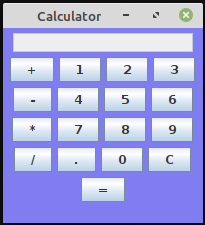

## Java Swing MVC Calculator 

This is a simple **Java Swing calculator** created on the **Model View Controller** design pattern.

I have implemented this simple app to teach my students
how to use **Swing** framework to create a simple GUI following the **MVC** pattern.

 

### How to use:

1. Copy the 4 java classes in a folder on your local machine.

2. Open a terminal and *cd* to the folder location
For example: 

```
cd my_Pc/Projects/swingCalculator
```

3. Compile the Main Java file ```CalculatorMain.java```:


```
Javac CalculatorMain.java
```

4. Run the Java class file which was generated from the previous compilation:
```
java CalculatorMain
```

Enjoy!
